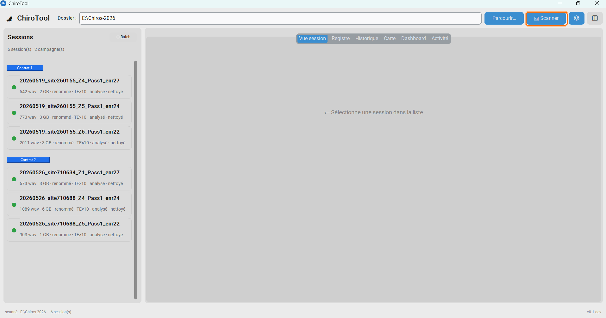
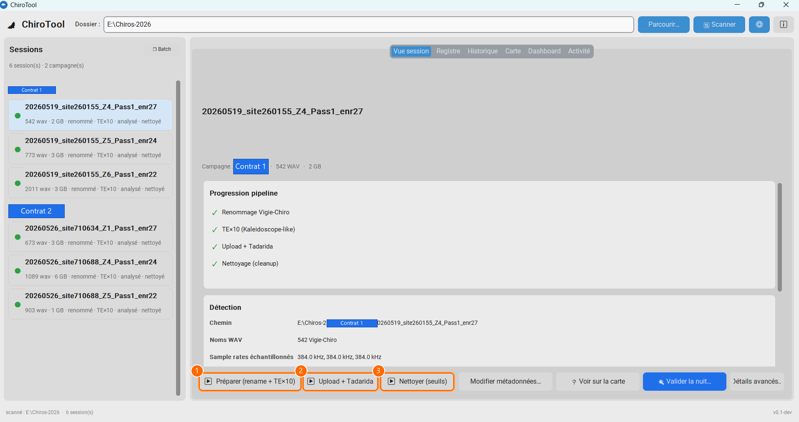
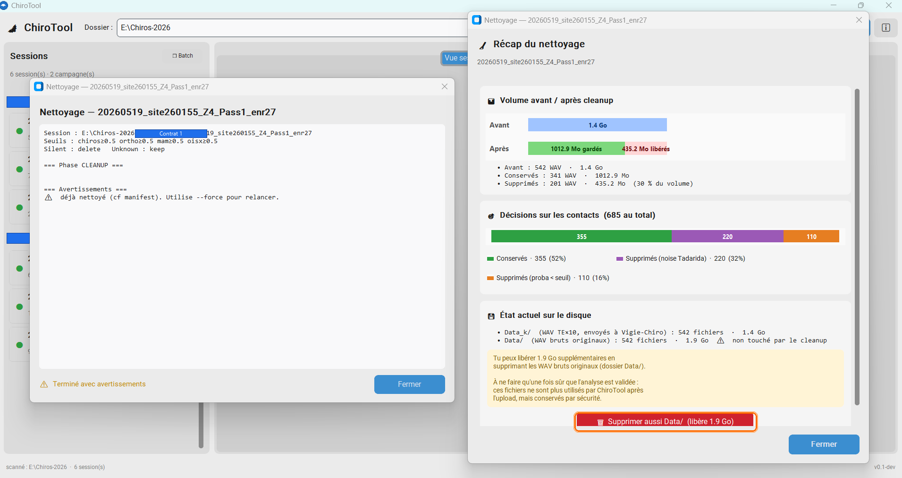
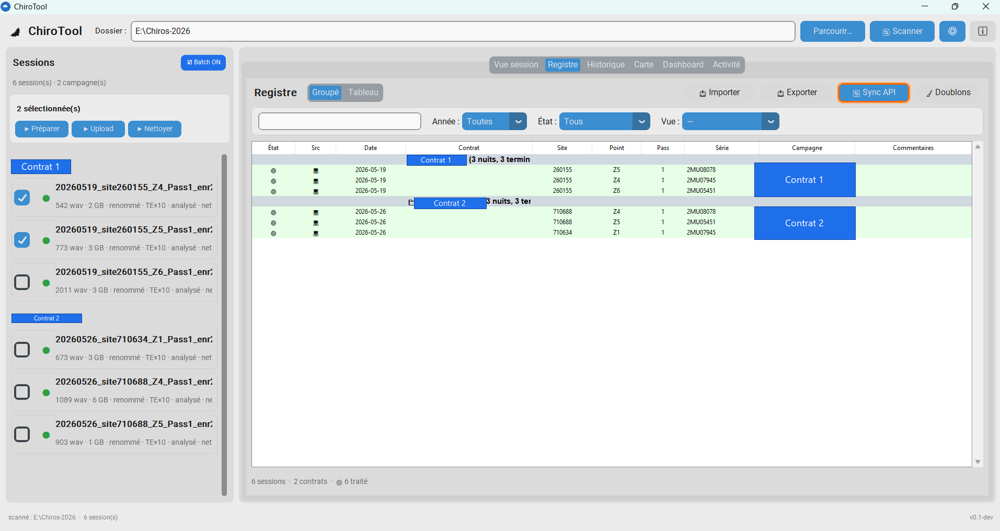

<div align="center">


# ChiroTool

### Le traitement de vos nuits chiroptères, automatisé de A à Z

Outil libre pour le protocole **[Vigie-Chiro Point Fixe](https://www.vigienature.fr/fr/chauves-souris)** (MNHN)

[](https://github.com/kevin-guille/ChiroTool/releases)
[](https://github.com/kevin-guille/ChiroTool/releases)
[](https://github.com/kevin-guille/ChiroTool/actions)
[](LICENSE)
[](https://www.python.org/)
[](#installation)

**[⬇ Télécharger l’exe](https://github.com/kevin-guille/ChiroTool/releases)** ·
**[📖 Tutoriel PDF](docs/ChiroTool-Tutoriel.pdf)** ·
**[💬 Ouvrir une issue](https://github.com/kevin-guille/ChiroTool/issues)**

</div>

---

## Pourquoi ChiroTool ?

Sur une nuit Point Fixe, le parcours manuel est long et fragile :

> renommer → expansion TE×10 → créer la participation → uploader des centaines de WAV → attendre Tadarida → récupérer le xlsx → nettoyer dans un tableur → archiver.

**ChiroTool regroupe toute la chaîne dans une seule application locale et portable**, pensée pour le terrain et le bureau d’études :

| Avant | Avec ChiroTool |
|-------|----------------|
| 5–6 logiciels / étapes | **1 application** de bout en bout |
| Kaleidoscope pour le TE×10 | **TE×10 intégré** (Python, accélération Rust optionnelle) |
| Upload manuel, fragile | **Upload parallèle + reprise** sur coupure |
| Nettoyage « à la main » risqué | **Aperçu chiffré + garde-fous** avant toute suppression |
| Suivi campagne dispersé | **Registre multi-sites**, graphes, carte, validation |

Idéal pour les **bureaux d’études**, **associations** et **observateurs** qui livrent des campagnes Vigie-Chiro fiables, traçables et plus rapides.

> ⚠️ **Outil indépendant** — ChiroTool utilise l’API publique Vigie-Chiro mais **n’est pas un outil officiel du MNHN**. Vos données restent sur votre poste ; le token ne quitte pas votre machine hors appels API légitimes.

---

## Nouveautés v0.5

La **v0.5** consolide ChiroTool pour une utilisation en production de campagne :

| | Nouveauté | Bénéfice terrain |
|---|-----------|------------------|
| 🔐 | **Token sécurisé** (Credential Manager / DPAPI ; saisie CLI masquée) | Plus de secret dans l’historique shell |
| 🧹 | **Nettoyage massif renforcé** (simulation chiffrée → confirmation → garde anti mass-delete) | Zéro suppression « surprise » de WAV |
| 📤 | **Envoi des identifications** vers Vigie-Chiro (sidecar, synchro, rollup registre) | Remontée observateur sans re-saisie |
| 📊 | **Synthèse d’activité** + référentiel national (saison / région / habitat) | Lecture rapide du niveau d’activité |
| 🎛️ | **Graphes refondus** (filtres, recherche, sections repliables) | Exploration fluide multi-nuits |
| 🧭 | **UX avant-publication** (métadonnées non devinées, confirmations safe, multi-écran) | Moins d’erreurs, plus de confort |
| ✅ | **CI automatique** (pytest sur chaque push) | Non-régression du moteur métier |

👉 Détail des versions : [Releases](https://github.com/kevin-guille/ChiroTool/releases)

---

## Aperçu

<p align="center">
  
</p>

<p align="center">
  
  &nbsp;
  
</p>

<p align="center">
  
  &nbsp;
  
</p>

---

## Fonctionnalités

### Chaîne de traitement

- **Renommage automatique** au format Vigie-Chiro (y compris auto-réparation de noms proches)
- **Expansion temporelle TE×10** intégrée, validée *bit-à-bit* (remplace Kaleidoscope)
- **Participation + upload** via l’API (workers parallèles, reprise, trigger compute)
- **Suivi Tadarida** et récupération des observations
- **Nettoyage par seuils** (chiros / orthos / micromammifères / oiseaux) avec aperçu et garde-fous

### Après l’analyse

- **Validation des contacts** (raccourcis, ChiroSurf, taxons, envoi des identifications)
- **Graphes d’activité** et **synthèse** avec niveaux de référence
- **Registre de campagne** multi-sites (SQLite, export CSV / xlsx)
- **Carte OSM** : carrés STOC, création de point, points sur carré d’un autre observateur

### Robustesse

- Application **locale et portable** (exe one-file ou Python)
- **Accélération Rust optionnelle** pour le TE×10 (fallback Python transparent)
- Mode **compatible antivirus** pour les postes verrouillés
- Manifest de session + vérifications pour un traitement **idempotent**

---

## Enregistreurs compatibles

Tout enregistreur dont les fichiers sont nommés `…AAAAMMJJ_HHMMSS….wav` :

| Famille | Modèles / notes |
|---------|-----------------|
| **Wildlife Acoustics** | SM2 / SM3 / SM4(BAT) / Mini Bat |
| **Autres horodatés** | Passive Recorder, Bat Recorder, etc. |
| **AudioMoth** | Fichiers *déjà expandés* via l’AudioMoth Configuration App (*File → Expand*). ChiroTool assure ensuite renommage + TE×10 (alternative à Kaleidoscope, devenu payant pour l’AudioMoth). |

Les formats à noms **non datés** (ex. Peersonic, Pettersson D500x) nécessitent un renommage préalable et ne sont pas encore pris en charge directement.

---

## Installation

### Option A — Exe portable (recommandé sur le terrain)

1. Téléchargez **`ChiroTool.exe`** depuis la
   [dernière release](https://github.com/kevin-guille/ChiroTool/releases).
2. Placez-le où vous voulez (clé USB, dossier campagne…).
3. Double-cliquez pour lancer.

**Mode portable** : créez un fichier vide `chirotool.cfg` à côté de l’exe  
→ config et préférences restent dans le même dossier.

**Mode installé** : sans ce marqueur, la config va dans `%APPDATA%\ChiroTool\`.

Au premier lancement : choisissez le **dossier de travail**, puis renseignez le
**token Vigie-Chiro** (Préférences → API, ou assistant d’onboarding).

---

### Option B — Depuis les sources (Python 3.11+)

#### PowerShell

```powershell
git clone https://github.com/kevin-guille/ChiroTool.git
cd ChiroTool
python -m pip install -r requirements.txt
python gui_app.py
```

#### Git Bash

```bash
git clone https://github.com/kevin-guille/ChiroTool.git
cd ChiroTool
python -m pip install -r requirements.txt
python gui_app.py
```

### Token API (une fois par poste)

Le token s’obtient après connexion au
[portail Vigie-Chiro](https://vigiechiro.herokuapp.com/)
(`localStorage` → clé `auth-session-token`). **Ne le partagez jamais**
(voir [SECURITY.md](SECURITY.md)).

**Via l’interface** (le plus simple) : *Préférences → API Vigie-Chiro*.

**Via la CLI** — saisie **masquée** (recommandé) :

```powershell
# PowerShell
python vigiechiro_api.py save-token
```

```bash
# Git Bash / terminal
python vigiechiro_api.py save-token
```

Autres options sûres :

```powershell
# Variable d'environnement (session courante)
$env:VIGIECHIRO_TOKEN = "VOTRE_TOKEN"
python vigiechiro_api.py save-token
```

```bash
# Pipe (évite l'historique argv)
echo VOTRE_TOKEN | python vigiechiro_api.py save-token
```

> ❌ Évitez `save-token VOTRE_TOKEN` en argument : le secret apparaît dans
> l’historique du shell et la liste des processus. Ce mode est **déprécié**.

Le token est stocké via le **Gestionnaire d’identifiants Windows** (ou DPAPI en secours).

### Accélération Rust (optionnelle)

Pour de gros volumes sur disque local rapide, compilez l’extension
`chirotool_fast` (gain typique ~×2 à ×10 selon le support).  
Sans elle, le TE×10 reste en **Python pur** — aucune action requise.

Voir [`rust_ext/README.md`](rust_ext/README.md).

---

## Utilisation en ligne de commande

Le moteur est **indépendant de l’interface** : tout peut tourner en CLI / scripts.

```bash
python scan.py [<racine>]                           # état des sessions
python vigiechiro_api.py save-token                 # token (saisie masquée)
python rename.py <session> --auto                   # renommage
python te10.py <session-ou-Data>                    # expansion temporelle
python cleanup.py <session> --threshold-chiros 0.5  # nettoyage par seuils
python pipeline.py <session> --advance --use-api    # pipeline complet (cloud)
python registry.py scan <racine>                    # (re)peuple le registre
python vigiechiro_api.py resolve-carre <lat> <lon>  # carré STOC (lecture)
```

---

## Tutoriel

Un **tutoriel illustré** (PDF) guide le premier lancement, une nuit complète,
le mode batch et la validation :

📘 **[`docs/ChiroTool-Tutoriel.pdf`](docs/ChiroTool-Tutoriel.pdf)**

Captures sources : [`docs/captures/`](docs/captures/).

---

## Architecture

Moteur Python testable sans UI + interface CustomTkinter.

| Couche | Modules clés |
|--------|----------------|
| **Logique pure** | `chiro_core`, `naming`, `taxons`, `manifest`, `verify`, `vigiechiro_enums` |
| **Accès données** | `vigiechiro_api`, `credentials`, `registry`, `suivi`, `suivi_write` |
| **Opérations** | `scan`, `rename`, `te10`, `cleanup`, `pipeline` |
| **GUI** | `gui_app`, `gui_validation`, `gui_map`, `gui_registry`, wizards… |
| **Natif (opt.)** | `rust_ext` → `chirotool_fast` |

Tests : `pytest tests/` (également en [CI GitHub Actions](https://github.com/kevin-guille/ChiroTool/actions)).

---

## Pour les naturalistes & bureaux d’études

Vous avez une saison Point Fixe devant vous ? **ChiroTool est fait pour ça.**

1. **[Téléchargez la v0.5](https://github.com/kevin-guille/ChiroTool/releases)** (exe ou sources)
2. Traitez une nuit test de bout en bout
3. Envoyez un retour — bug, idée, besoin de formation —
   via une [**issue GitHub**](https://github.com/kevin-guille/ChiroTool/issues)
   ou en contactant l’auteur

Les retours terrain (BE, assos, observateurs) orientent directement la roadmap.
Le code est **libre (MIT)** : audit, adaptation interne, contribution bienvenus —
voir [`CONTRIBUTING.md`](CONTRIBUTING.md).

---

## Sécurité

- Token chiffré localement (Credential Manager / DPAPI)
- Pas d’envoi du token ailleurs que vers l’API Vigie-Chiro (HTTPS)
- Signalement de vulnérabilité **en privé** — voir [`SECURITY.md`](SECURITY.md)

---

## Licence

Distribué sous licence **[MIT](LICENSE)** — usage, modification et redistribution libres.

---

## Crédits

- **Auteur** : [Kevin Guille](https://fr.linkedin.com/in/kevin-guille-764b6a150) — chargé d’études naturalistes
- **Avec le soutien de** : [Acer Campestre](https://www.acer-campestre.fr/)
  ([LinkedIn](https://fr.linkedin.com/company/acer-campestre))
- **Protocole & API** : [Vigie-Chiro / MNHN](https://www.vigienature.fr/fr/chauves-souris)

---

<div align="center">

🦇 **Bon traitement, et bonnes chauves-souris !**

[⬆ Télécharger](https://github.com/kevin-guille/ChiroTool/releases)
·
[📖 Tutoriel](docs/ChiroTool-Tutoriel.pdf)
·
[💬 Issues](https://github.com/kevin-guille/ChiroTool/issues)

</div>
