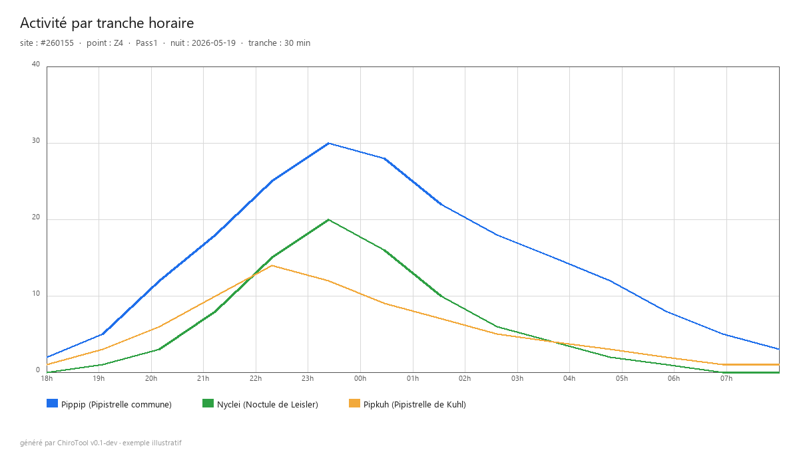

<div align="center">

# 🦇 ChiroTool

### Le traitement de vos nuits chiroptères, automatisé de A à Z

*Outil libre pour le protocole **Vigie-Chiro Point Fixe** (MNHN)*


**Version 0.2** · Tutoriel utilisateur

</div>

---

## Sommaire

1. [À quoi sert ChiroTool ?](#1--à-quoi-sert-chirotool-)
2. [Le principe en une image](#2--le-principe-en-une-image)
3. [Installation](#3--installation)
4. [Premier lancement : la configuration en 2 minutes](#4--premier-lancement--la-configuration-en-2-minutes)
5. [Comprendre l'interface](#5--comprendre-linterface)
6. [Traiter une nuit, étape par étape](#6--traiter-une-nuit-étape-par-étape)
7. [Traiter plusieurs nuits d'un coup (mode Batch)](#7--traiter-plusieurs-nuits-dun-coup-mode-batch)
8. [Valider les sons (avec ChiroSurf)](#8--valider-les-sons-avec-chirosurf)
9. [Visualiser l'activité des espèces](#9--visualiser-lactivité-des-espèces)
10. [Travailler en équipe](#10--travailler-en-équipe)
11. [Questions fréquentes & dépannage](#11--questions-fréquentes--dépannage)
12. [Limites connues](#12--limites-connues)
13. [Crédits & licence](#13--crédits--licence)

---

## 1 · À quoi sert ChiroTool ?

Si vous faites du **Point Fixe Vigie-Chiro**, vous connaissez la corvée : pour
chaque nuit d'enregistrement, il faut renommer les fichiers (LupasRename),
appliquer l'expansion temporelle (Kaleidoscope), créer une participation sur le
portail Vigie-Chiro, uploader les WAV, attendre le mail de Tadarida, télécharger
le tableur, puis nettoyer les contacts inutiles à la main dans Excel.

Sur une campagne de 60 contrats × plusieurs nuits, cela représente des **journées
entières** de manipulations répétitives, sujettes aux erreurs.

**ChiroTool fait tout ça à votre place**, depuis une seule fenêtre :

| Avant (manuel) | Avec ChiroTool |
|---|---|
| LupasRename → renommer les WAV | ✅ Renommage automatique au format Vigie-Chiro |
| Kaleidoscope → expansion temporelle | ✅ TE×10 intégré (validé bit-à-bit, jusqu'à ×2 plus rapide) |
| Portail web → créer la participation | ✅ Création automatique via l'API |
| Upload manuel des fichiers | ✅ Upload parallèle (3 à 5× plus rapide) |
| Attendre le mail Tadarida | ✅ Suivi automatique, notification quand c'est prêt |
| Excel → trier les contacts à la main | ✅ Nettoyage automatique par seuils de confiance |
| Tableur de suivi à jour à la main | ✅ Registre central + export pour le suivi d'équipe |

**En résumé** : vous déposez vos dossiers de nuits, vous cliquez, et ChiroTool
gère le renommage, l'expansion temporelle, l'envoi à Vigie-Chiro, l'analyse
Tadarida, le nettoyage et le suivi. Vous gardez la main sur ce qui compte : la
**validation scientifique** des espèces.

C'est **gratuit, local et open-source**. Vos données restent chez vous (sauf les
WAV envoyés à Vigie-Chiro, comme d'habitude).

---

## 2 · Le principe en une image

```
   Retour de terrain : vous déposez vos dossiers de nuits
   sous un dossier "espace de travail" (workspace)
                          │
                          ▼
   ┌──────────────────────────────────────────────────┐
   │  ▶ PRÉPARER     renommage + expansion temporelle  │
   │  ▶ UPLOAD       envoi à Vigie-Chiro + Tadarida    │
   │  ▶ NETTOYER     purge des contacts non pertinents │
   └──────────────────────────────────────────────────┘
                          │
                          ▼
   Résultats : tableur d'observations propre,
   graphes d'activité, suivi de campagne centralisé
```

Trois boutons, dans l'ordre. C'est tout.

---

## 3 · Installation

ChiroTool est un **logiciel portable** : pas d'installation, pas de droits
administrateur requis.

1. Récupérez le fichier **`ChiroTool.exe`** (≈ 33 Mo) auprès de votre référent ou
   sur la page de téléchargement officielle.
2. Placez-le où vous voulez (Bureau, clé USB, disque dur externe…).
3. Double-cliquez pour le lancer.

> 📸 **[Capture 01 — `ChiroTool.exe` dans l'explorateur Windows, avec son icône
> bleue]**

> **Note Windows** : au premier lancement, Windows SmartScreen peut afficher un
> avertissement (logiciel non signé). Cliquez sur **« Informations
> complémentaires »** puis **« Exécuter quand même »**. C'est normal pour un
> logiciel libre non distribué via le Microsoft Store.

### Deux modes de fonctionnement

- **Mode installé** (par défaut) : la configuration est stockée dans votre profil
  Windows (`%APPDATA%\ChiroTool\`).
- **Mode portable** : posez un fichier vide nommé `chirotool.cfg` à côté de
  l'`.exe`. La configuration sera alors stockée à côté du logiciel (pratique pour
  une clé USB qui passe d'un poste à l'autre).

---

## 4 · Premier lancement : la configuration en 2 minutes

Au tout premier démarrage, un **assistant d'accueil** s'ouvre automatiquement. Il
vous guide en 3 étapes.

> 📸 **[Capture 02 — Assistant d'accueil, étape 1 : Token Vigie-Chiro]**

### Étape 1 — Votre token Vigie-Chiro

Le **token** est votre clé d'accès personnelle à l'API Vigie-Chiro. Il permet à
ChiroTool de créer des participations et d'uploader vos enregistrements **à votre
nom**.

Pour le récupérer :

1. Cliquez sur **« 🌐 Ouvrir le portail »** et connectez-vous à Vigie-Chiro.
2. Ouvrez les outils de développement du navigateur : touche **F12** → onglet
   **Console**.
3. Cliquez sur **« 📋 Copier »** dans ChiroTool, puis collez la commande dans la
   console et appuyez sur **Entrée**.
4. Une suite de 32 caractères s'affiche. Copiez-la et collez-la dans le champ
   **Token** de ChiroTool.
5. Cliquez sur **« Tester »** : vous devriez voir *« ✓ token valide — connecté en
   tant que [votre pseudo] »*.

> 💡 Le token est valable ~30 jours. Quand il expire, refaites cette manipulation
> (Préférences → API Vigie-Chiro).

### Étape 2 — Votre dossier de travail

Choisissez (ou créez) un **dossier racine** où vous déposerez vos campagnes. Par
exemple : `D:\Chiros-2026\`. À l'intérieur, vous aurez un sous-dossier par
contrat/campagne.

C'est dans ce dossier que ChiroTool rangera son index interne et ses sauvegardes
(dans un sous-dossier `_chirotool/` qu'il ne faut pas supprimer).

> 📸 **[Capture 03 — Assistant d'accueil, étape 2 : Dossier de travail]**

### Étape 3 — Votre parc de matériel (optionnel mais recommandé)

Saisissez vos enregistreurs (numéro, marque, modèle, n° de série, micro…). Une
fois renseignés, ils seront proposés automatiquement dans les menus déroulants
lors de la saisie des métadonnées : plus besoin de retaper les séries à chaque
nuit, et **zéro faute de frappe**.

> 📸 **[Capture 04 — Préférences → onglet « Mes matériels »]**

> 💡 **Astuce équipe** : si votre structure a déjà un fichier de parc
> (`materiels.json`), posez-le simplement dans votre dossier de travail :
> ChiroTool vous proposera de l'importer automatiquement au premier scan.

---

## 5 · Comprendre l'interface

> 📸 **[Capture 05 — Fenêtre principale : barre du haut, liste des sessions à
> gauche, onglets à droite]**

La fenêtre se compose de trois zones :

**① La barre du haut** — choisir le dossier de travail (`Parcourir…`), le
scanner (`🔄 Scanner`), accéder aux préférences (`⚙`) et aux informations
(`ℹ`).

**② La liste des sessions (à gauche)** — toutes vos nuits, regroupées par
campagne. Une pastille de couleur indique l'état de chaque nuit :

| Pastille | Signification |
|---|---|
| 🔴 rouge | Brut (rien n'a encore été fait) |
| 🟡 jaune | En cours de traitement |
| 🟠 orange ⏳ | Upload interrompu, **à reprendre** |
| 🟢 vert | Nuit complètement traitée |

**③ Le panneau de détail (à droite)** — 6 onglets :

- **Vue session** : les infos de la nuit sélectionnée + les boutons d'action
- **Registre** : toutes vos nuits, toutes campagnes confondues (suivi global)
- **Historique** : la chronologie des opérations faites sur une nuit
- **Carte** : vos points sur fond OpenStreetMap / IGN
- **Dashboard** : statistiques transverses de vos campagnes
- **Activité** : les graphes d'activité par tranche horaire

---

## 6 · Traiter une nuit, étape par étape

Prenons un exemple concret : vous revenez du terrain avec une nuit d'un SM Mini.

### Étape 0 — Déposer les fichiers

Copiez votre dossier de nuit dans votre dossier de travail, sous le bon contrat :

```
D:\Chiros-2026\
└── Contrat_1\                 ← le contrat (nom de votre choix)
    └── 19052026_260155_22_Z6\  ← votre dossier de nuit (peu importe le nom exact)
        ├── 2MU05451_Summary.txt
        └── Data\
            ├── 2MU05451_20260519_203704.wav
            ├── 2MU05451_20260519_203711.wav
            └── ...
```

### Étape 1 — Scanner

Dans ChiroTool, vérifiez que le dossier de travail est le bon, puis cliquez sur
**« 🔄 Scanner »**. Vos nuits apparaissent dans la liste de gauche.

Cliquez sur votre nuit : son détail s'affiche à droite.

> 📸 **[Capture 06 — Vue session avec les 3 boutons d'action : Préparer, Upload,
> Nettoyer]**

### Étape 2 — Préparer (renommage + expansion temporelle)

Cliquez sur **« ▶ Préparer »**.

ChiroTool va d'abord chercher à **deviner automatiquement** les métadonnées de la
nuit (site, point, passage, enregistreur…) à partir du nom du dossier, du fichier
`Summary.txt` et de votre tableur de suivi.

- **Si tout est trouvé** : une fenêtre de confirmation s'affiche, vous validez.
- **Si une info manque** : l'assistant de saisie des métadonnées s'ouvre.

> 📸 **[Capture 07 — Assistant « Métadonnées de la session »]**

Dans cet assistant :

- **Contrat** : le nom du projet (un bouton ▾ propose ceux déjà saisis)
- **Date de début** : la date de pose (un bouton 📅 ouvre un calendrier)
- **N° site Tadarida** : les 6 chiffres du carré
- **Point** : Z1, A2, etc.
- **Passage** : 1, 2…
- **N° enregistreur** : choisissez-le dans la liste (il remplit automatiquement
  la série et le micro depuis votre parc « Mes matériels »)

Cliquez sur **« Valider »**.

ChiroTool exécute alors :
1. Le **renommage** des WAV au format Vigie-Chiro (`Car260155-2026-Pass1-Z6-…`)
2. L'**expansion temporelle ×10** (création du dossier `Data_k/`)

Une **barre de progression** vous indique l'avancement en temps réel.

> 📸 **[Capture 08 — Fenêtre de progression avec la barre et l'ETA]**

### Étape 3 — Upload + Tadarida

Cliquez sur **« ▶ Upload + Tadarida »**.

Un **assistant de participation** s'ouvre, déjà **pré-rempli** au maximum
(météo depuis le Summary.txt, matériel depuis votre parc, dates…) :

> 📸 **[Capture 09 — Assistant « Nouvelle participation Vigie-Chiro »]**

- **Conditions météo** : températures, vent (menu déroulant), couverture nuageuse
- **Matériel** : détecteur, micro, hauteur (pré-remplis depuis votre parc)
- Complétez ce qui manque, puis **« Valider »**.

ChiroTool enchaîne alors **trois phases automatiques** :

1. **Upload** — envoi des WAV vers Vigie-Chiro (en parallèle, donc rapide).
2. **Attente Tadarida** — l'analyse tourne **sur les serveurs Vigie-Chiro**.
   Cela peut prendre de quelques minutes à quelques heures. **Vous pouvez fermer
   l'application** : cliquez sur **« 🔌 Arrière-plan »**, l'analyse continue
   côté serveur sans vous.
3. **Téléchargement** — dès que c'est prêt, le tableur d'observations est récupéré
   automatiquement.

> 💡 **Si vous avez fermé l'app** : il suffira de re-cliquer « Upload + Tadarida »
> plus tard. ChiroTool détecte que la participation existe déjà, ne ré-uploade
> rien d'inutile, et récupère directement le résultat.

### Étape 4 — Nettoyer

Une fois le tableur récupéré, cliquez sur **« ▶ Nettoyer »**.

ChiroTool applique vos **seuils de confiance** (réglables dans Préférences →
Nettoyage) pour décider quels WAV garder :

> 📸 **[Capture 10 — Préférences → onglet « Nettoyage »]**

- Un **contact** est conservé si sa probabilité Tadarida ≥ votre seuil pour ce
  groupe (chiros, orthos, etc.).
- Un **fichier WAV** est gardé dès qu'**au moins un** de ses contacts est conservé
  (règle « OR »).
- Les contacts classés **« noise »** par Tadarida sont toujours supprimés.
- Les **validations humaines** (si vous avez déjà validé via ChiroSurf) sont
  **prioritaires** sur les seuils.

Un **garde-fou** vous protège : si plus de 80 % des WAV allaient être supprimés
(seuil mal réglé, mauvais tableur…), ChiroTool bloque et vous alerte.

À la fin, un **récapitulatif visuel** s'affiche : volume avant/après, espace
disque libéré, et la possibilité de supprimer aussi les WAV bruts d'origine
(`Data/`) si vous voulez libérer encore plus de place.

> 📸 **[Capture 11 — Récapitulatif du nettoyage avec le graphe avant/après]**

✅ **La nuit est traitée.** La pastille passe au vert.

---

## 7 · Traiter plusieurs nuits d'un coup (mode Batch)

Vous avez 10 nuits à traiter ? Pas besoin de les faire une par une.

1. En haut de la liste des sessions, cliquez sur **« ☐ Batch »**.
2. Des **cases à cocher** apparaissent sur chaque nuit. Cochez celles à traiter.
3. Cliquez sur l'action voulue : **▶ Préparer**, **▶ Upload** ou **▶ Nettoyer**.

> 📸 **[Capture 12 — Mode Batch activé, plusieurs nuits cochées + barre
> d'actions]**

ChiroTool traite alors **toutes les nuits sélectionnées** :

- Pour la **préparation** et le **nettoyage** : une nuit après l'autre.
- Pour l'**upload** : les envois s'enchaînent, puis **toutes les analyses Tadarida
  attendent en parallèle** (le serveur travaille sur plusieurs nuits à la fois).
  Chaque nuit terminée récupère son tableur dès qu'il est prêt.

Vous pouvez **fermer l'application** pendant l'attente : les analyses continuent
côté serveur. Au retour, relancez « Upload » sur les nuits concernées (ou utilisez
« 🔄 Sync API » dans le Registre) pour récupérer les résultats.

---

## 8 · Valider les sons (avec ChiroSurf)

L'identification de Tadarida est automatique : pour fiabiliser vos données, vous
voudrez sûrement **valider manuellement** les contacts importants (espèces
patrimoniales, identifications douteuses…).

1. Sur une nuit dont le tableur est récupéré, cliquez sur **« 🔍 Valider la
   nuit… »**.
2. Un tableau filtrable des contacts s'affiche.
3. Sélectionnez un contact, puis :
   - Utilisez les **raccourcis clavier** `O` / `P` / `S` pour indiquer votre
     niveau de confiance (pOssible / Probable / Sûr).
   - **Double-cliquez** sur une ligne pour ouvrir le WAV correspondant dans
     **ChiroSurf** (à condition d'avoir indiqué le chemin de ChiroSurf dans
     Préférences → Outils externes).
4. Vos validations sont sauvegardées dans un nouveau tableur suffixé de vos
   initiales (ex : `…_KG.xlsx`).

> 💡 Si vous nettoyez **après** avoir validé, vos décisions humaines sont
> respectées : un faux « noise » que vous avez corrigé en *Pipistrelle* sera
> conservé.

---

## 9 · Visualiser l'activité des espèces

L'onglet **« Activité »** transforme vos tableurs d'observations en **graphes
d'activité horaire** — parfait pour un rapport ou une analyse.



*Exemple : activité de trois espèces sur une nuit, par tranche de 30 minutes.*

À gauche, des **filtres** permettent de cibler précisément :

- **Sites** (carrés STOC) et **Points** (Z1, Z2…)
- **Passages** (Pass1, Pass2…)
- **Nuits** (une seule, ou plusieurs à cumuler)
- **Taxons** (espèces et groupes)

Deux modes :

- **Cumulé** : une courbe par espèce, somme de tous les points/nuits sélectionnés.
- **« Détailler par point »** : une courbe par couple espèce × point — idéal pour
  comparer Z4 et Z5 d'un même carré sur la même nuit.

> 💡 La « nuit biologique » est gérée correctement : un contact à 2h du matin est
> rattaché à la nuit commencée la veille au soir.

Cliquez sur **« 💾 Exporter PNG »** pour obtenir une image propre du graphe
(titre, axes, légende inclus) à glisser dans vos rapports.

---

## 10 · Travailler en équipe

ChiroTool est pensé pour les structures où **plusieurs personnes** font du
terrain.

### Le Registre : votre suivi global

L'onglet **« Registre »** affiche **toutes vos nuits, toutes campagnes
confondues**, avec leur état d'avancement.

> 📸 **[Capture 13 — Onglet Registre, vue groupée par contrat]**

Vous pouvez :
- Filtrer par année, contrat, état, ou rechercher
- Éditer les commentaires (double-clic)
- **« 🔄 Sync API »** : se synchroniser avec Vigie-Chiro pour récupérer l'état des
  participations (et détecter les nuits faites par d'autres)
- **« 🧹 Doublons »** : nettoyer d'éventuelles entrées en double (après un
  changement de PC, par exemple)

### Partager le suivi : l'export CSV

Bouton **« 📤 Exporter »** → **CSV** : vous obtenez un fichier complet (38
colonnes) avec toutes vos nuits. Chaque membre de l'équipe peut exporter le sien,
et un responsable peut les fusionner pour avoir la **vue d'ensemble de la
campagne** (qui a fait quoi, où, combien de nuits restent).

### Partager le matériel

Le parc d'enregistreurs peut être **exporté** (📤) et **importé** (📥) entre
postes, ou simplement déposé dans le dossier de travail commun pour un import
automatique.

---

## 11 · Questions fréquentes & dépannage

**« L'application affiche un avertissement Windows au lancement. »**
C'est normal (logiciel libre non signé). Cliquez sur « Informations
complémentaires » → « Exécuter quand même ».

**« Mon token ne fonctionne plus. »**
Il a probablement expiré (~30 jours). Refaites la procédure F12 (Préférences →
API Vigie-Chiro).

**« La préparation s'arrête avec une erreur de fichiers en double. »**
Certains enregistreurs produisent occasionnellement des fichiers mal nommés ou en
double. Vérifiez le dossier `Data/` et retirez les fichiers manifestement
corrompus, puis relancez.

**« L'upload s'est interrompu (PC éteint, coupure réseau). »**
Aucun problème : la nuit s'affiche en orange ⏳ « à reprendre ». Re-cliquez
« Upload + Tadarida » : seuls les fichiers manquants seront renvoyés.

**« Je ne peux pas cliquer sur "Nettoyer". »**
Le bouton est grisé tant que le tableur d'observations n'a pas été récupéré
(étape Upload + Tadarida). C'est normal.

**« Où sont stockées mes données ? »**
Votre index et vos sauvegardes sont dans le sous-dossier `_chirotool/` de votre
dossier de travail. Un fichier `README.txt` y explique chaque fichier. **Ne le
supprimez pas** (sinon ChiroTool devra tout re-scanner).

**« L'application s'est fermée toute seule. »**
Un fichier de journal est créé dans `%APPDATA%\ChiroTool\chirotool.log`.
Envoyez-le à votre référent ou via la page Issues du projet, cela aide à
diagnostiquer.

---

## 12 · Limites connues

ChiroTool couvre la grande majorité des cas, mais pas (encore) tout :

- **Fichiers compressés `.w4v` / `.wac`** : non décompressés (utilisez Kaleidoscope
  en amont).
- **Création d'un nouveau site (nouveau carré STOC)** : non couverte — passez par
  le portail web Vigie-Chiro. ChiroTool permet en revanche d'**ajouter un point**
  à un site existant (via la carte).
- **Modifier une participation déjà créée** (météo erronée…) : via le portail web.

---

## 13 · Crédits & licence

**ChiroTool** est un projet **libre et open-source**.

- **Auteur** : GUILLE Kevin — Chargé d'études naturalistes
  [LinkedIn](https://fr.linkedin.com/in/kevin-guille-764b6a150)
- **Avec le soutien de** : [Acer Campestre](https://www.acer-campestre.fr/) —
  bureau d'études en écologie
  ([LinkedIn](https://fr.linkedin.com/company/acer-campestre))
- **Protocole & API** : [Vigie-Chiro / MNHN](https://www.vigienature.fr/fr/chauves-souris)
- **Licence** : MIT (usage et contributions libres)

> 🐙 Code source, bugs et contributions : [github.com/kevin-guille/ChiroTool](https://github.com/kevin-guille/ChiroTool)

---

<div align="center">

*Vous avez des retours, des bugs, des idées ? N'hésitez pas à les remonter.*
*ChiroTool grandit grâce aux utilisateurs de terrain.*

**Bon traitement, et bonnes chauves-souris ! 🦇**

</div>
